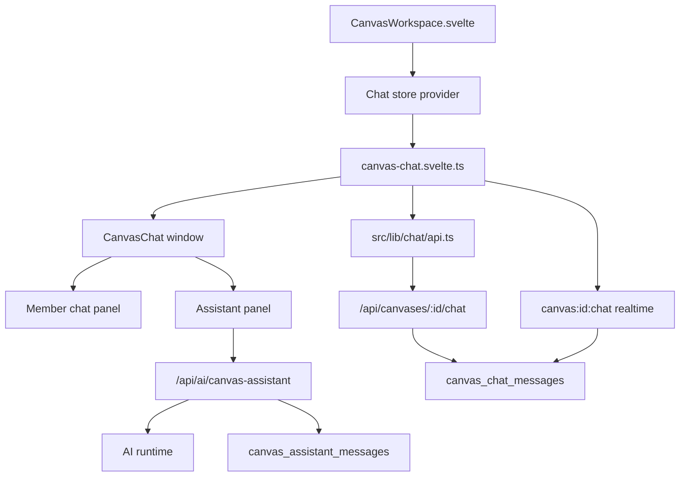
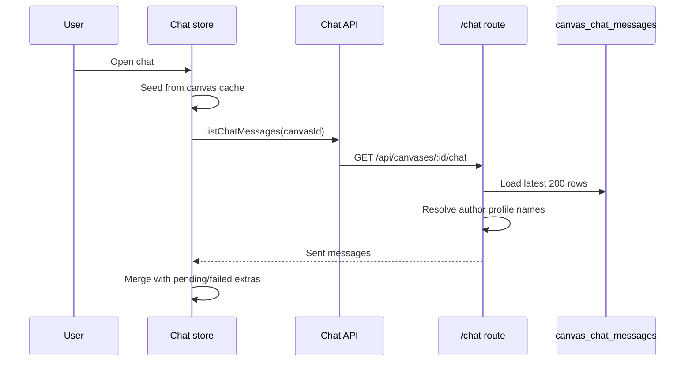
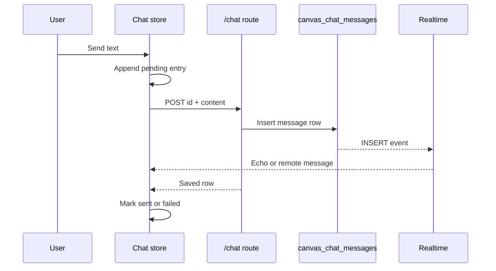
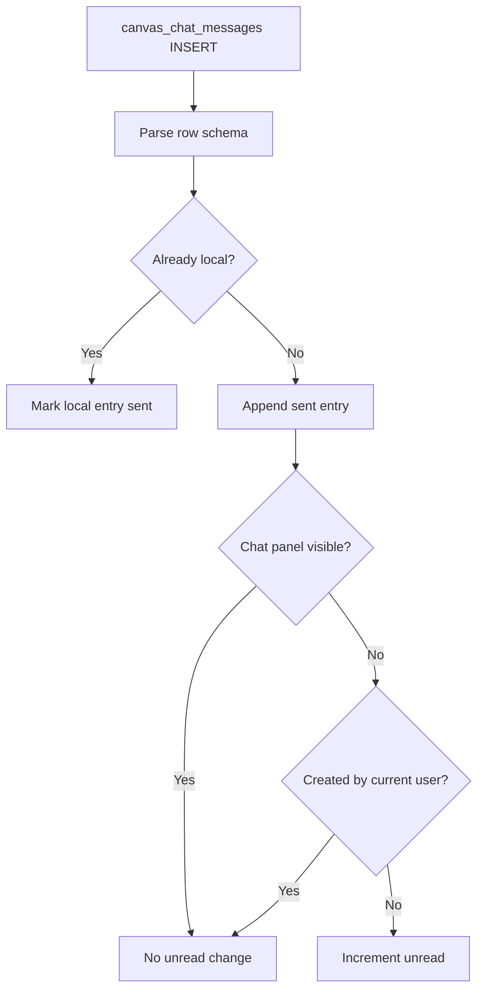
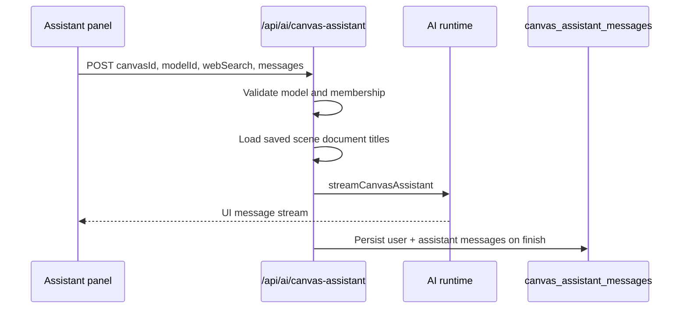

# Canvas Chat Architecture

This document explains how chat works in the canvas workspace. It covers the
shared member chatroom and the private canvas assistant thread.

## Purpose

Canvas chat gives members a realtime conversation surface without leaving the
workspace. The same floating window also hosts a private AI assistant thread for
the active canvas.

The design goal is to keep UI state, optimistic sends, realtime delivery, and
assistant history in one focused store while keeping server routes authoritative
for access and persistence.

## Scope

| Surface | Purpose | Storage | Realtime |
| --- | --- | --- | --- |
| Member chatroom | Shared text chat for canvas members | `canvas_chat_messages` | Supabase INSERT events |
| Canvas assistant | Private per-user AI thread for the canvas | `canvas_assistant_messages` | AI response stream only |

Document-scene AI chat is separate. It belongs to scenes, persists in
`canvas_scene_messages`, and is covered by `SCENES_ARCHITECTURE.md`.

## High-Level Architecture



`CanvasWorkspace.svelte` provides the chat store above sibling subtrees that
need it. The floating launcher/window consumes the store directly, and the
conference fullscreen view can render the same member chat panel.

## Responsibility Split

| Section | Responsibility |
| --- | --- |
| Workspace shell | Provides the store and hides chat from public viewers. |
| Chat store | Owns open/minimized state, active tab, caches, optimistic entries, unread count, assistant bootstrap, and realtime subscription. |
| Chat components | Render the launcher, window, member chat panel, assistant panel, message lists, and composers. |
| Chat schemas | Validate member message rows, API responses, assistant rows, and assistant requests. |
| Chat API wrappers | Call chat endpoints and parse responses into typed client data. |
| Member chat route | Lists latest member messages and inserts new messages with author metadata. |
| Assistant history route | Lists the caller's private assistant messages for one canvas. |
| Assistant AI route | Streams model responses and persists completed assistant turns. |

## Key Modules

| Module | Responsibility |
| --- | --- |
| `src/lib/stores/chat/canvas-chat.svelte.ts` | Store and context provider for all canvas chat surfaces. |
| `src/lib/components/canvas/chat/CanvasChat.svelte` | Top-level launcher and window composition. |
| `src/lib/components/canvas/chat/CanvasChatRoomPanel.svelte` | Shared member chat room. |
| `src/lib/components/canvas/chat/CanvasAssistantThread.svelte` | Private assistant thread. |
| `src/lib/chat/schema.ts` | Zod schemas and row-to-client mapping. |
| `src/lib/chat/api.ts` | HTTP client helpers. |
| `src/routes/api/canvases/[canvasId]/chat/+server.ts` | Member chat GET/POST endpoint. |
| `src/routes/api/canvases/[canvasId]/assistant-messages/+server.ts` | Private assistant history endpoint. |
| `src/routes/api/ai/canvas-assistant/+server.ts` | Assistant streaming endpoint. |
| `src/lib/server/canvas-assistant-chat.ts` | Idempotent assistant turn persistence. |

## Data Model

Member chat rows:

```text
canvas_chat_messages
  id uuid primary key
  canvas_id uuid
  content text, 1..4000 characters
  metadata jsonb, usually { author: { id, name } }
  created_by uuid
  created_at timestamptz
```

Client shape:

```ts
type ChatMessage = {
  id: string
  canvasId: string
  content: string
  author: { id: string; name: string } | null
  createdBy: string | null
  createdAt: string
}
```

Assistant rows:

```text
canvas_assistant_messages
  id text primary key
  canvas_id uuid
  user_id uuid
  role user | assistant | system
  parts jsonb
  metadata jsonb
  created_at timestamptz
```

Assistant ids are AI SDK `UIMessage.id` values. Completed turns are upserted by
id so retries and finish handling remain idempotent.

## Member Chat Load Flow

History loads lazily when the chat window first opens, or when another surface
explicitly calls `ensureLoaded()`.



Older history and pagination are out of scope today; the route returns the
latest 200 messages.

## Member Chat Send Flow

Sending is optimistic. The store creates a pending message with a
client-generated UUID, then posts that same id to the server.



Important details:

- Empty messages are ignored by the store and rejected by schemas.
- Messages over 4000 characters are rejected by schemas and the database check.
- Failed sends remain local because no row was broadcast.
- Unique-id retries return the existing row if it belongs to the caller.
- Realtime echoes are deduped by id and can confirm pending sends before the
  POST response returns.

## Realtime And Unread Flow

The store subscribes from mount, not from first open, so unread badges work
before a user opens the window.



Unread means a member chat message arrived while the chat room was not visible.
If the window is open on the Assistant tab, the badge is shown on the Chat tab.

## Canvas Assistant Flow

The Assistant tab is private to the current user.



Saved scene documents from the canvas are offered as assistant context: titles
are included up front, and document content loads on demand. Assistant rows are
not realtime-published; active output arrives through the stream and saved
history reloads through HTTP.

## Access And Permission Boundaries

Chat is members-only:

- Public viewers do not get the chat launcher.
- The store skips realtime traffic when `getEnabled()` is false.
- Member chat GET/POST require canvas membership.
- Assistant history and generation require canvas membership.
- Shared chat RLS scopes readable rows and realtime delivery to allowed users.
- Assistant message RLS is private to `user_id = auth.uid()`.

Client gating is for user experience. Server routes remain the authority.

## Failure Boundaries

Member chat load errors, send errors, and assistant load errors are tracked
separately so one tab can fail without breaking the other. Canvas switches reset
per-canvas state and then seed from module-level caches keyed by canvas id.

## Where To Add New Behavior

Use the smallest owner of the behavior:

- Add member chat UI behavior in the chat components.
- Add optimistic send, unread, tab, or cache behavior in the chat store.
- Add member chat payload fields in `src/lib/chat/schema.ts`, the `/chat`
  route, and the `canvas_chat_messages` table together.
- Add assistant request fields in `canvasAssistantRequestSchema` and
  `/api/ai/canvas-assistant`.
- Add assistant persistence behavior in `persistCanvasAssistantChat`.
- Add model/tool behavior in the AI runtime.
- Change membership or public-viewer behavior in both the client gate and the
  server routes/RLS policy.
