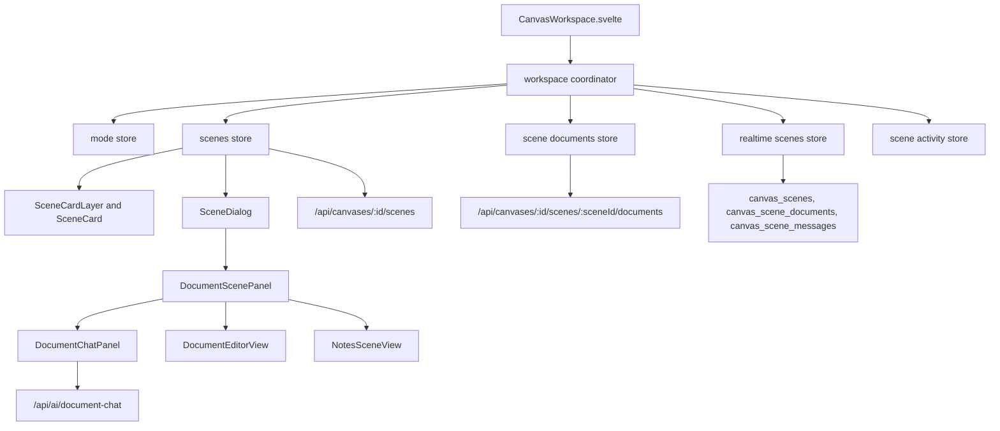
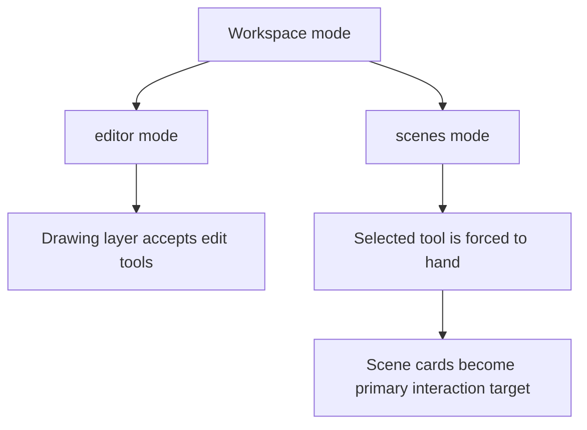
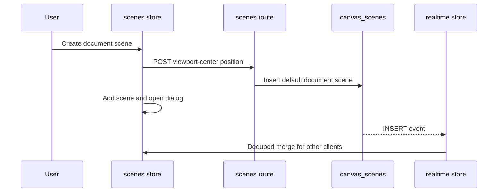
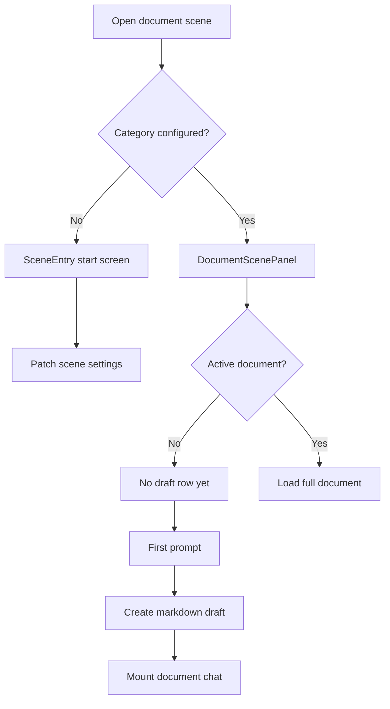
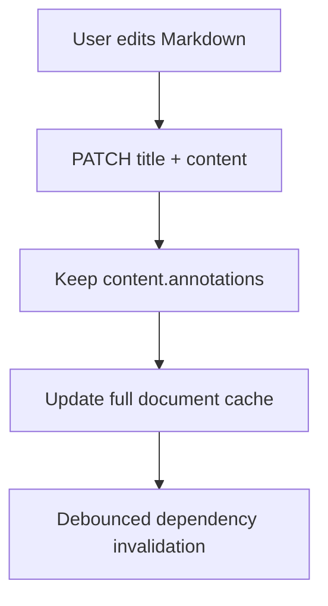
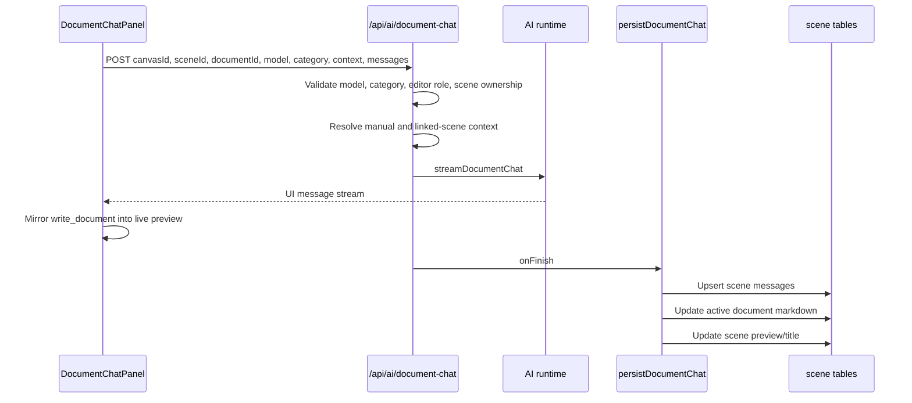
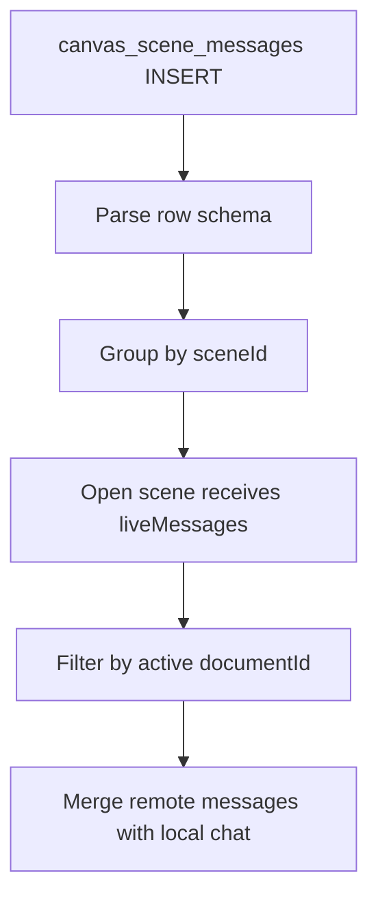
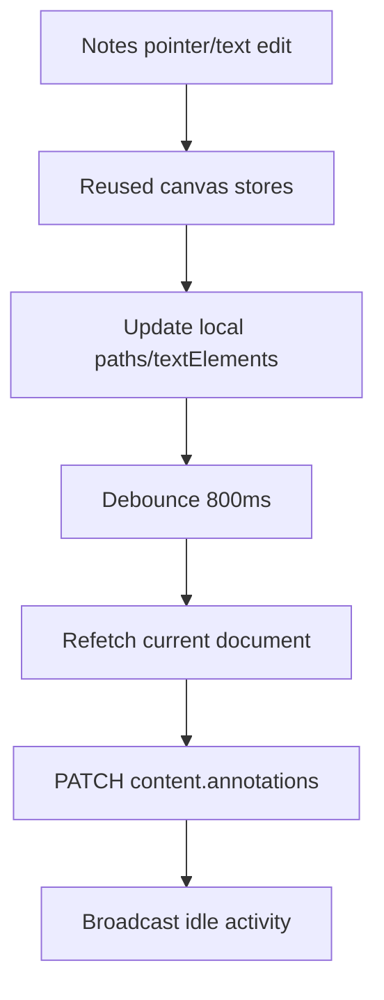

# Scenes And Document Workspace Architecture

This document explains how scene cards, document scenes, document AI chat, and
notes annotations fit into the canvas workspace.

## Purpose

Scenes let a canvas hold larger work areas without turning the drawing surface
into a document editor. A scene appears as a card in canvas world-space, opens
into a focused dialog, and owns its own documents, AI chat history, and notes.

The design goal is to keep scene cards lightweight while heavy document content
and chat history live in dedicated tables and stores.

## Scope

The current scene system has one registered scene type:

| Type | Purpose | Notes |
| --- | --- | --- |
| `document` | Draft Markdown documents with AI chat, editor, saved-document library, and notes | The only registered scene type today. |

Notes are not a scene type. They are a view inside a document scene and are
stored as annotations on the active document content.

## High-Level Architecture



Scenes are coordinated from the workspace store. Drawing connectors can bind to
scene cards, and document chat can use linked scene cards as context through
connector relationships.

## Responsibility Split

| Section | Responsibility |
| --- | --- |
| Workspace coordinator | Wires scenes into the canvas shell and exposes scene state/handlers. |
| Mode store | Persists per-canvas `editor` or `scenes` mode. |
| Scenes store | Owns scene list state, create/update/delete, card drag/resize/open behavior, and document revision counters. |
| Scene documents store | Caches document list items and full documents, refreshes scenes, and schedules route revalidation. |
| Realtime scenes store | Subscribes to scene, document, and scene-message database events. |
| Scene activity store | Broadcasts transient generating/drawing/idle activity and streamed text deltas. |
| Scene components | Render card layer, cards, dialog shell, entry screen, and document scene content. |
| Server routes | Enforce canvas role and scene ownership, then read/write scene tables. |

## Key Modules

| Module | Responsibility |
| --- | --- |
| `src/lib/stores/workspace/coordinator.svelte.ts` | Workspace-level scene wiring and public store surface. |
| `src/lib/stores/scenes/scenes.svelte.ts` | Scene card lifecycle and transforms. |
| `src/lib/stores/scenes/documents.svelte.ts` | Scene document caches and refetch/revalidation. |
| `src/lib/stores/scenes/realtime-scenes.svelte.ts` | Supabase `postgres_changes` scene subscriptions. |
| `src/lib/stores/scenes/scene-activity.svelte.ts` | Broadcast-only activity channel. |
| `src/lib/components/canvas/scenes/SceneDialog.svelte` | Modal scene workspace shell. |
| `src/lib/components/canvas/scenes/document/DocumentScenePanel.svelte` | Document selection, draft creation, chat/editor/notes view state, save/promote/delete, and message bootstrap. |
| `src/lib/components/canvas/scenes/notes/NotesSceneView.svelte` | Annotation workspace over an active document. |
| `src/lib/scenes/schema.ts` | Scene, document, message, and document-chat schemas. |
| `src/lib/scenes/registry.ts` | Scene type registry and defaults. |
| `src/lib/server/scene-access.ts` | Server-side scene/document access helpers. |

## Data Model

Scene cards are stored in `canvas_scenes`:

```text
canvas_scenes
  id uuid primary key
  canvas_id uuid
  type text
  title text
  x, y, width, height, rotation
  settings jsonb
  created_by uuid
  updated_by uuid
  created_at, updated_at
```

`settings` is per-scene-type configuration. Document scenes use it for values
such as `category`, `modelId`, and card `preview`.

Scene documents are stored in `canvas_scene_documents`:

```text
canvas_scene_documents
  id uuid primary key
  scene_id uuid
  canvas_id uuid
  kind text
  status draft | saved
  title text
  content jsonb
  created_by uuid
  updated_by uuid
  created_at, updated_at
```

Markdown document content:

```ts
type MarkdownDocumentContent = {
  docType?: string
  markdown: string
  annotations?: {
    paths: Array<{ id: string }>
    textElements: Array<{ id: string }>
  }
}
```

Scene AI messages are stored in `canvas_scene_messages`:

```text
canvas_scene_messages
  id text primary key
  scene_id uuid
  canvas_id uuid
  document_id uuid | null
  role user | assistant | system
  parts jsonb
  metadata jsonb
  created_by uuid
  created_at timestamptz
```

`document_id` scopes each conversation to the document it was written against.
The `parts` array stores AI SDK `UIMessage.parts` as-is.

## Workspace Mode

Editors and owners see the mode switcher. Readers can open existing scene cards
but do not see the switcher.



Entering scenes mode commits active text edits and remembers the previous tool.
Returning to editor mode restores that tool for users who can edit.

## Scene Card Lifecycle



Important details:

- Creation is latched so rapid clicks create one card.
- Default size and title come from `sceneTypes`.
- Drag and resize update local state immediately, then persist on pointer-up.
- Realtime UPDATEs do not clobber a card the local user is dragging, resizing,
  or transforming.
- Delete is optimistic; failures restore the previous scene list.
- Double-click, Enter, or the maximize button opens the dialog.

## Document Scene Flow

A document scene opens to a start screen until `scene.settings.category` is set.
Starting a scene patches category/model settings, then mounts the document scene
panel.

Draft documents are created lazily. Opening a blank scene does not create a row.
A draft is created only when the user sends the first prompt or starts from the
blank composer.



The document panel keeps a metadata list and loads full content on demand. It
keeps explicit selections across refreshes, clears deleted selections, and does
not auto-select another document.

## Document Library And Editor

Documents can be `draft` or `saved`. Saved documents appear in the context
picker for future prompts.

Manual editor saves target an explicit document id so an unmount or active
selection change cannot write stale text into a newly selected document. Manual
saves replace Markdown while preserving the notes annotation layer.



## Document AI Chat Flow

Document chat posts to `/api/ai/document-chat`.



Context documents come from manually selected saved documents in the same scene
and from saved documents in linked scenes. Linked-scene context is derived from
connector bindings: bidirectional connectors and connectors flowing into the
active scene provide context.

## Scene Message Realtime Flow

Document chat history is read-only over HTTP. New messages are persisted by the
AI route when a generation finishes and delivered to collaborators through
realtime INSERT events.



Before sending a prompt, the chat panel folds remote messages into the AI SDK
history so collaborator turns become model context.

## Notes Annotation Flow

The notes view is an annotation workspace over the active Markdown document. It
reuses the canvas interaction, formatting, text editor, and history stores
through dependency injection.



Notes persistence rules:

- Only the annotation layer belongs to the notes store.
- The store refetches the document before saving so Markdown changes are
  preserved.
- Remote annotation refreshes never clobber dirty local work, an in-progress
  stroke, or an active text edit.

## Realtime Channels

| Channel | Purpose |
| --- | --- |
| `canvas:{id}:scenes` | Database events for `canvas_scenes`, `canvas_scene_documents`, and `canvas_scene_messages`. |
| `canvas:{id}:scenes-activity` | Broadcast-only transient scene activity: generating, drawing, idle, and streamed text deltas. |

Database event behavior:

- Scene INSERT adds cards.
- Scene UPDATE merges remote changes unless the local card is busy.
- Scene DELETE removes cards and closes the dialog if it was open.
- Document events are refetch signals because content can be large.
- Scene message INSERTs become live messages for open dialogs.

Activity behavior:

- Generating text deltas are buffered and flushed every 150ms.
- Idle clears remote activity and streaming text for the scene.
- Stale activity is pruned after 10 seconds.

## Access And Permission Boundaries

| Action | Boundary |
| --- | --- |
| List scenes, documents, messages | Minimum reader access to the canvas. |
| Create a scene | Minimum editor access to the canvas. |
| Update/delete a scene | Editor must own the scene; owner/admin can modify any scene. |
| Create/update/delete a document | Same modify boundary as the parent scene. |
| Run document AI chat | Editor access plus permission to modify the parent scene. |
| Open/read scene cards | Readers can view and open. |

Writes go through server routes using the service-role Supabase client. RLS is
used for SELECT policies so realtime delivery is scoped to canvas participants.

## Where To Add New Behavior

Use the smallest owner of the behavior:

- Add a new scene type in `src/lib/scenes/types.ts`, `registry.ts`, and the
  `SceneDialog` component map.
- Add card movement, resize, open, or create behavior in the scenes store.
- Add workspace mode behavior in the mode store and coordinator.
- Add document list/cache behavior in the scene documents store.
- Add document scene UI behavior in `DocumentScenePanel` or its child panel.
- Add document AI request fields in `documentChatRequestSchema` and
  `/api/ai/document-chat`.
- Add AI persistence behavior in `persistDocumentChat`.
- Add linked-context rules in `src/lib/scenes/context-links.ts`.
- Add notes drawing/text behavior in the notes store only when it is specific to
  annotations; otherwise reuse the shared canvas stores.
