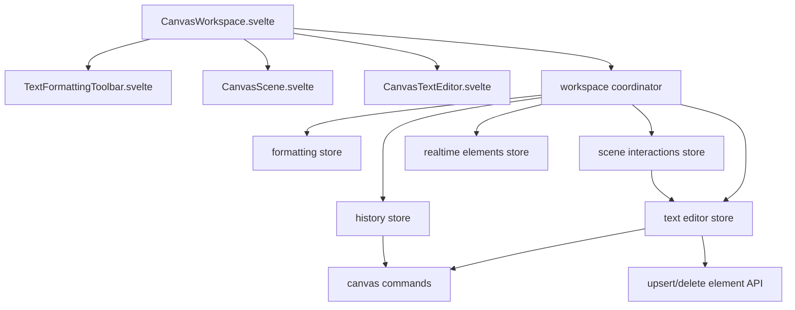
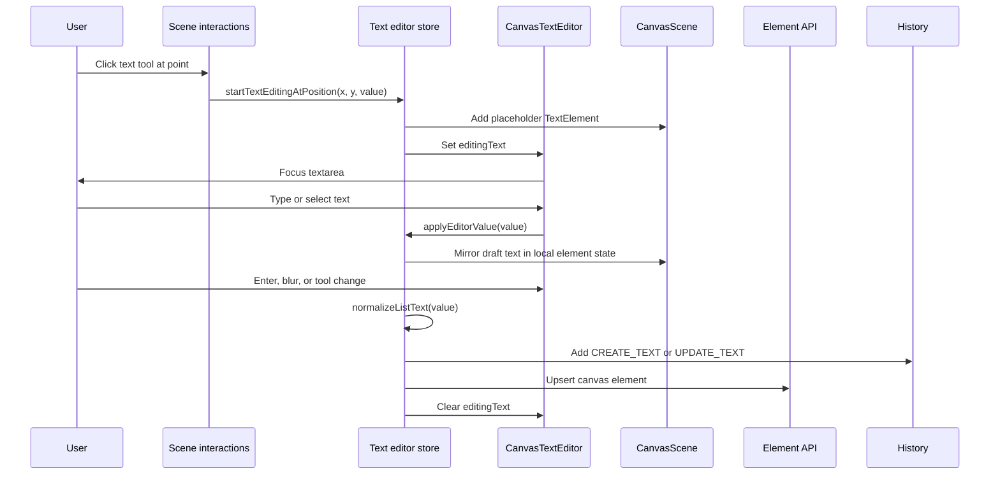
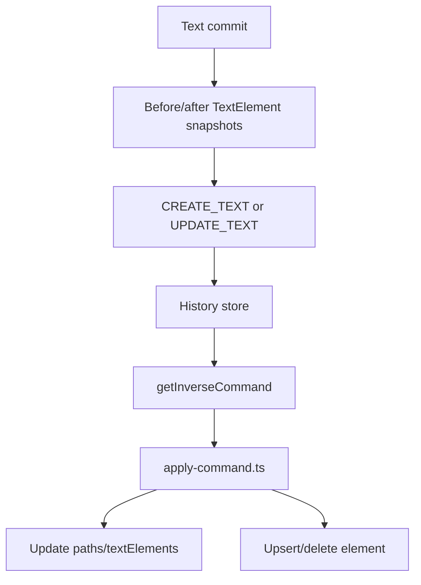

# Text Editor And Rich Text Architecture

This document explains how text editing works in the canvas app and why the
current implementation is closer to a canvas text system than a full
document-style rich text editor. It is written as a system-design note: product
requirements, data model, component boundaries, user flows, persistence,
collaboration, tradeoffs, and future extension paths.

## Scope

The app has three text-editing surfaces:

| Surface | User-facing purpose | Editing model | Storage |
| --- | --- | --- | --- |
| Canvas text elements | Short labels, callouts, and simple formatted text on the drawing canvas | Plain `textarea` overlay while editing; SVG text after commit | `canvas_elements.data` |
| Notes annotations | Text annotations drawn over a rendered Markdown document | Reuses the canvas text editor and canvas command model | `scene_documents.content.annotations.textElements` |
| Document editor | Long-form document content edited inside a scene | Plain Markdown `textarea` with autosave | `scene_documents.content.markdown` |

The phrase "rich text" currently means element-level formatting on canvas text:
font size, color, bold, italic, underline, and list markers. It does not mean a
ProseMirror/Tiptap-style inline document tree where each word or span can carry
different marks.

## Product Requirements

The current editor is optimized for a collaborative drawing workspace:

- Create text at an arbitrary canvas coordinate.
- Edit an existing text element in place.
- Render committed text at the same scale and position as the drawing layer.
- Keep editing responsive while zooming and panning.
- Support simple formatting controls that apply to the entire text element.
- Support bullet and numbered lists inside the plain-text editor.
- Commit edits to the existing canvas element persistence path.
- Integrate with undo and redo as meaningful canvas-level commands.
- Avoid overwriting an in-progress local edit with a realtime update.
- Reuse the same annotation layer over documents.

Non-goals for the current canvas editor:

- Mixed inline formatting inside one text element.
- Rich paste normalization from arbitrary HTML.
- Nested lists, tables, links, comments, mentions, or embeds.
- Character-level collaborative editing.
- A full WYSIWYG document model.

## High-Level Architecture

The text editor is split into rendering, interaction, formatting, command, and
persistence responsibilities.



The Svelte component tree stays mostly presentational. `CanvasWorkspace.svelte`
renders the toolbars, SVG scene, text editor overlay, scene cards, cursors, and
dialogs. The workspace coordinator wires those components to focused stores:
formatting, text editing, scene interactions, history, camera, realtime, access,
and presence.

## Key Modules

| Module | Responsibility |
| --- | --- |
| `src/lib/components/canvas/CanvasWorkspace.svelte` | Renders the workspace and passes editor props/handlers into the visible components. |
| `src/lib/components/canvas/CanvasTextEditor.svelte` | Floating `textarea` overlay used while a canvas text element is being edited. |
| `src/lib/components/canvas/TextFormattingToolbar.svelte` | Toolbar for font size, bold, italic, underline, list style, and color. |
| `src/lib/components/canvas/CanvasScene.svelte` | SVG drawing layer that renders committed text elements as `<text>` and `<tspan>` nodes. |
| `src/lib/stores/canvas/workspace/text-editor.svelte.ts` | Owns text edit lifecycle, list handling, commit/cancel behavior, history creation, and persistence. |
| `src/lib/stores/canvas/workspace/formatting.svelte.ts` | Owns current text and drawing formatting state. |
| `src/lib/stores/canvas/workspace/scene-interactions.svelte.ts` | Turns pointer events into canvas actions, including starting text edits. |
| `src/lib/canvas/text-lists.ts` | Pure functions for plain-text bullet and numbered list behavior. |
| `src/lib/canvas/commands.ts` | Defines undoable canvas commands, including `CREATE_TEXT` and `UPDATE_TEXT`. |
| `src/lib/canvas/apply-command.ts` | Applies commands and inverse commands back into local state and persistence. |
| `src/lib/canvas/element-mapping.ts` | Converts server rows and realtime rows into local `TextElement` objects. |
| `src/lib/stores/canvas/scenes/notes.svelte.ts` | Reuses the same editor stores for document annotation text. |
| `src/lib/components/canvas/scenes/document/DocumentEditorView.svelte` | Separate Markdown document editor surface. |

## Data Model

Canvas text is intentionally simple.

```ts
type TextElement = {
  id: string
  text: string
  x: number
  y: number
  color: string
  fontSize: number
  isBold: boolean
  isItalic: boolean
  isUnderline: boolean
}
```

`TextElement.text` is a plain string. Newlines are significant. List items are
stored as visible text markers, including bullet prefixes and `"1. "` numbered
prefixes, not as structured list nodes.

The persisted text payload is derived from the text element:

```ts
{
  text: string,
  color: string,
  fontSize: number,
  isBold: boolean,
  isItalic: boolean,
  isUnderline: boolean
}
```

This shape keeps realtime sync, undo snapshots, server validation, and SVG
rendering straightforward. The cost is that inline formatting is not
representable without changing the model.

## Editing Lifecycle

Text editing is temporary and overlay-based.



Important details:

- A new text element gets a temporary placeholder in local state so it appears
  immediately while editing.
- Existing text editing snapshots the original element so commit can create an
  undoable `UPDATE_TEXT` command.
- Empty committed text deletes the element or removes the uncommitted draft.
- `Escape` cancels editing and removes an empty draft.
- `Enter` commits the element. `Shift+Enter` is used for newline/list behavior.
- Blur commits unless focus is moving into the formatting toolbar.

## Rendering Model

While editing, the text is an absolutely positioned HTML `textarea`.

The overlay position is computed from canvas coordinates and camera transform:

```text
screenX = camera.x + editingText.x * camera.scale
screenY = camera.y + editingText.y * camera.scale
fontSizePx = textFormatting.fontSize * camera.scale
```

After commit, the same text element is rendered inside the SVG scene:

```svelte
<text
  fill={text.color}
  font-size={text.fontSize}
  font-style={text.isItalic ? 'italic' : 'normal'}
  font-weight={text.isBold ? 'bold' : 'normal'}
  text-decoration={text.isUnderline ? 'underline' : 'none'}
>
  {#each text.text.split('\n') as line, lineIndex}
    <tspan x={text.x} y={text.y + lineIndex * getTextLineHeight(text.fontSize)}>
      {line}
    </tspan>
  {/each}
</text>
```

This gives the canvas precise control over position, zoom, selection outlines,
hit-testing, and export behavior. It also means text measurement is approximate:
`calculateTextBounds()` uses longest line length and font size, not browser text
layout APIs.

## Formatting Model

The formatting store owns the current text formatting state:

- `fontSize`
- `isBold`
- `isItalic`
- `isUnderline`
- `color`
- `listStyle`

The formatting toolbar updates this store. When the user edits an existing text
element, the formatting store syncs from that element first, so the toolbar
reflects the selected text's appearance.

Formatting is element-level. Toggling bold while editing changes the current
formatting state and therefore the whole text element on commit. It does not
apply bold only to the current selection.

## List Behavior

Lists are implemented as plain-text transformations in `text-lists.ts`.

The list module owns:

- marker detection with `getLineMarker()`
- marker stripping with `stripLineMarker()`
- numbered list renumbering with `renumberLines()`
- selected-line list toggling with `toggleListStyle()`
- list continuation with `continueListOnEnter()`
- commit-time cleanup with `normalizeListText()`
- legacy element-level list migration with `applyLegacyListStyle()`

This avoids introducing a structured rich text document model just for bullets
and numbered lists. It also keeps list behavior testable as pure functions.

Tradeoff: list semantics are visual/plain-text semantics. There is no nested
list tree, no indent model, and no separate ordered-list node type.

## Undo And Redo

Text changes participate in the same command system as paths and movement.

Relevant command types:

- `CREATE_TEXT`
- `UPDATE_TEXT`
- `DELETE_ELEMENT`
- `DELETE_MULTIPLE`
- `MOVE_ELEMENT`
- `MOVE_MULTIPLE`

The text editor store emits commands only at meaningful commit points. This is a
canvas-level undo model, not a character-by-character editor transaction model.



This makes undo predictable for canvas users: one text edit session becomes one
undo step. If the product needs rich editor undo granularity inside a long text
document, that should live in a document editor surface rather than the canvas
element command stack.

## Persistence And Realtime Sync

The main canvas stores text elements as rows in `canvas_elements`.

On commit:

1. Local state updates immediately.
2. A history command is recorded.
3. `upsertElement` writes the text payload to the API.
4. On write failure, the store rolls local state back when it has enough
   context.

Realtime element sync hydrates remote row changes into local `TextElement`
objects through `element-mapping.ts`. If the local user is currently editing a
text element, the realtime element store skips clobbering that in-progress edit.

The notes annotation surface uses the same editor stores, but injects different
mutation handlers. Instead of writing each annotation as a standalone
`canvas_elements` row, `notes.svelte.ts` debounce-saves the full annotation
snapshot into the active document's `content.annotations`.

## Document Editor Surface

`DocumentEditorView.svelte` is separate from canvas text. It is a plain Markdown
editor with:

- a title input
- a Markdown `textarea`
- dirty-state tracking
- debounced autosave
- flush-on-unmount behavior
- remote update adoption when there are no local edits

Documents persist as:

```ts
{
  docType?: string,
  markdown: string,
  annotations?: {
    paths: unknown[],
    textElements: unknown[]
  }
}
```

This is the best candidate for a future Tiptap or ProseMirror migration because
it already represents long-form document content rather than positioned canvas
labels.

## Why Not Tiptap For Canvas Text Today?

Tiptap is a good fit for a full rich text document editor. The canvas text
system has different constraints:

- Text is positioned in 2D canvas space, not inside document flow.
- The stored object is one canvas element, not a document tree.
- Rendering must line up with SVG selection, hit-testing, export, and camera
  transforms.
- Undo is command-based at the canvas operation level.
- Realtime sync is element-row sync, not character-level collaborative editing.
- Current formatting is element-level, so a ProseMirror document model would be
  mostly unused unless inline formatting becomes a requirement.

Migrating canvas text to Tiptap would require more than replacing the
`textarea`. It would require a new text document schema, serialization format,
SVG/HTML rendering strategy, undo bridge, paste policy, and migration path for
existing text elements.

## System Design Tradeoffs

| Decision | Benefit | Cost |
| --- | --- | --- |
| Use `textarea` for active editing | Native selection, keyboard input, IME, copy/paste, low complexity | No inline marks or structured nodes |
| Render committed text as SVG | Fits canvas transform, selection, hit-testing, and export | Approximate text measurement and layout |
| Store plain text plus flags | Simple persistence, realtime, undo snapshots, and migrations | Cannot represent mixed formatting |
| Treat lists as text markers | Small implementation, pure tests, easy storage | No nested lists or semantic list tree |
| Commit text edits as one command | Canvas-friendly undo behavior | No character-level undo history after commit |
| Reuse editor stores for notes annotations | Shared behavior and less duplication | Annotation persistence needs adapter mutations |

## Extension Paths

### Add Small Canvas Text Features

Keep the current architecture and extend the existing model when adding:

- font family
- text alignment
- fixed-width text boxes
- resize handles
- better text measurement
- line-height control
- background fill behind text
- simple hyperlink-looking text without clickable inline ranges

These features can remain element-level and continue using the `textarea` plus
SVG rendering model.

### Add Inline Rich Formatting To Canvas Text

This is a larger migration. Recommended shape:

```ts
type RichTextElement = {
  id: string
  x: number
  y: number
  width?: number
  content: RichTextDocument
}
```

Where `RichTextDocument` is either:

- a custom lightweight span model, or
- a ProseMirror/Tiptap JSON document.

Required work:

- version the persisted payload with `docType` or `schemaVersion`
- migrate existing `TextElement` rows into the new shape
- decide whether committed text renders as SVG spans or absolutely positioned
  HTML
- update hit-testing and bounds calculation for rich layout
- bridge editor transactions into canvas commands
- define paste sanitization and allowed marks/nodes
- add tests for serialization and legacy migration

### Move The Document Editor To Tiptap

This is lower risk than changing canvas text. A reasonable design:

1. Keep Markdown as the persisted source of truth initially.
2. Mount Tiptap only in `DocumentEditorView.svelte`.
3. Convert Markdown to editor state on load.
4. Serialize editor state back to Markdown on autosave.
5. Keep the current `docType` field available for a future JSON payload.
6. Add round-trip tests for headings, lists, code blocks, links, and AI-written
   Markdown.

If Markdown round-tripping becomes too lossy, introduce a new document content
payload:

```ts
{
  docType: 'tiptap-json',
  json: unknown,
  markdown?: string,
  annotations?: DocumentAnnotations
}
```

The optional Markdown field can remain as an export/search/AI-context format.

## Testing Strategy

Current tests cover the pure list behavior and canvas command inversion. Keep
that style for future editor work:

- Pure list transformations: no DOM required.
- Element serialization and legacy migration: input rows to `TextElement`.
- Bounds and hit-testing: deterministic geometry tests.
- Command inversion: before/after snapshots and undo/redo behavior.
- Editor lifecycle: create, edit, empty commit, cancel, blur, and toolbar focus.
- Notes persistence adapter: annotation snapshot is preserved while Markdown is
  refreshed from the server.

For a future rich text migration, add fixtures for:

- old plain text row -> new rich text row
- rich text JSON -> rendered HTML/SVG output
- editor transaction -> canvas command
- paste sanitization
- Markdown import/export if documents continue to store Markdown

## Operational Considerations

Performance:

- Active editing uses one textarea, so typing cost is low.
- Committed rendering is one SVG `<text>` node per element with one `<tspan>` per
  line.
- Bounds calculation is cheap but approximate.

Collaboration:

- The current model is last-write-wins at the element level.
- It avoids local clobbering while a user is editing.
- It is not designed for simultaneous character-level collaborative editing in
  the same text element.

Security:

- Canvas text is rendered as text nodes, not raw HTML.
- Markdown rendering for notes/documents is sanitized before injection.
- Client-side permission gates are UX only; server routes remain authoritative.

Accessibility:

- The active editor uses a native textarea, which gives baseline keyboard and
  screen-reader behavior while editing.
- Committed SVG text is visual canvas content and should be treated as part of
  the canvas scene rather than a document reading surface.

## Recommendation

Keep the custom canvas text editor for positioned canvas text and notes
annotations. It matches the current requirements and data model.

If richer long-form writing is needed, introduce Tiptap first in
`DocumentEditorView.svelte`. That path isolates the rich text document model to
the document surface and avoids forcing the canvas element system to become a
full document editor.
