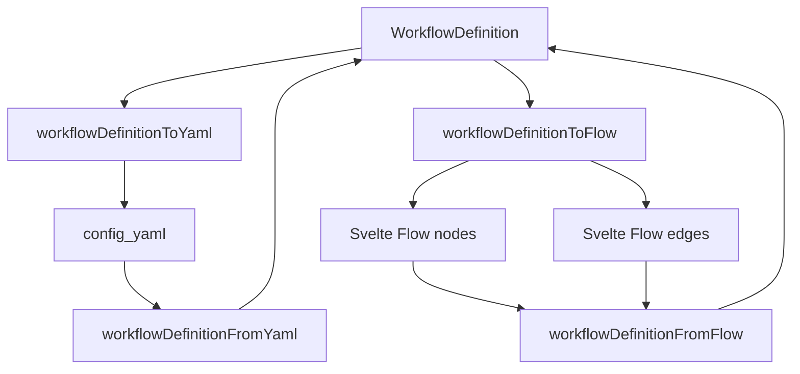
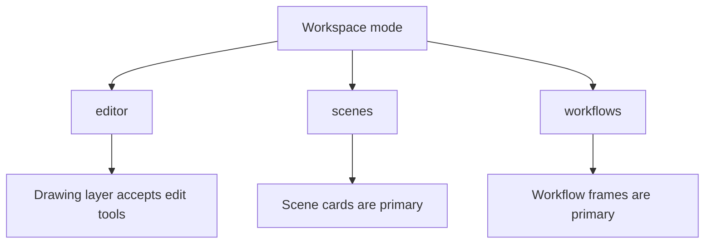
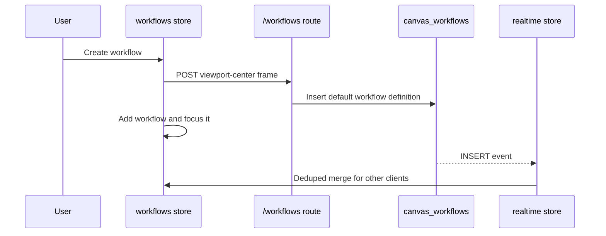

# Workflows Architecture

This document explains how workflow containers, YAML-backed node graphs, workflow
versions, and workflow assistant proposals fit into the canvas workspace.

## Purpose

Workflows let a canvas hold fenced node-graph areas without mixing them into the
freeform drawing layer. A workflow appears directly on the canvas as a movable
and resizable container. Inside the container, users can edit a visual graph or
the matching YAML definition.

The current implementation is intentionally visual-first. Workflow nodes can
store inert action metadata, but there is no runtime executor yet. The data
model is shaped so an execution layer can be added later without replacing the
canvas UI or the YAML schema.

## Feature Flag

Workflows are behind a server-side environment flag:

```env
WORKFLOW_ENABLED=false
```

The default is disabled. Any truthy value except `false` or `0` enables the
feature.

When disabled:

- The canvas page does not query workflow tables.
- The mode switcher does not show `Workflows`.
- The workflow layer is not imported into the canvas page bundle.
- Workflow API routes return 404 through `requireWorkflowsEnabled()`.

When enabled, the workflow database migration must already be applied. If the
tables do not exist, the canvas page load can fail when it tries to list
workflows for the active canvas.

## Scope

| Surface | Purpose | Storage | Realtime |
| --- | --- | --- | --- |
| Workflow frame | Fenced canvas-world container for a workflow graph | `canvas_workflows` | Supabase INSERT, UPDATE, DELETE events |
| Workflow definition | Versioned node graph model with YAML round trip | `canvas_workflows.definition`, `canvas_workflows.config_yaml` | Carried by workflow row updates |
| Workflow versions | Manual snapshots of definition, YAML, and notes | `canvas_workflow_versions` | Loaded on demand |
| Workflow assistant | AI proposal route that can rewrite a workflow definition | Not persisted until user applies proposal | Request/response only |

## High-Level Architecture

```mermaid
flowchart TD
  Page[Canvas page load] --> Flag[WORKFLOW_ENABLED]
  Flag -->|false| WorkspaceNoWorkflow[CanvasWorkspace without workflow layer]
  Flag -->|true| Workflows[Load initial workflows]

  Workflows --> Shell[CanvasWorkspace.svelte]
  Shell --> Coordinator[workspace coordinator]
  Coordinator --> Store[workflows store]
  Coordinator --> Realtime[realtime workflows store]
  Coordinator --> Mode[mode store]

  Store --> Layer[WorkflowLayer.svelte]
  Layer --> Frame[WorkflowFrame.svelte]
  Layer --> Graph[WorkflowGraph.svelte]
  Layer --> Panels[WorkflowBuilderPanels.svelte]

  Store --> WorkflowApi[/api/canvases/:id/workflows]
  Panels --> VersionApi[/api/canvases/:id/workflows/:workflowId/versions]
  Panels --> AiRoute[/api/ai/workflow-assistant]

  WorkflowApi --> Rows[canvas_workflows]
  VersionApi --> Versions[canvas_workflow_versions]
  Realtime --> Rows
```

The workflow layer is lazy-loaded from `CanvasWorkspace.svelte` only when the
server load returns `workflowEnabled: true`. This keeps the experimental graph
editor out of the normal deployed canvas path while the flag is off.

## Responsibility Split

| Section | Responsibility |
| --- | --- |
| Feature flag helpers | Read `WORKFLOW_ENABLED` and block workflow API routes when disabled. |
| Canvas page load | Loads initial workflow rows only when workflows are enabled. |
| Workspace coordinator | Wires workflow state into the canvas shell and prevents `workflows` mode when disabled. |
| Mode switcher | Shows `Editor`, `Scenes`, and optionally `Workflows`. |
| Workflows store | Owns workflow list state, create/update/delete, focus, drag, resize, YAML patches, and optimistic rollback. |
| Realtime workflows store | Merges remote workflow row changes and avoids clobbering locally busy frames. |
| Workflow components | Render canvas frames, the Svelte Flow graph editor, YAML/notes panels, context controls, versions, and assistant proposals. |
| Server routes | Enforce the flag, canvas access, workflow ownership, validation, and persistence. |
| Workflow schema utilities | Validate workflow definitions and convert between YAML and graph nodes/edges. |

## Key Modules

| Module | Responsibility |
| --- | --- |
| `src/lib/server/features.ts` | `WORKFLOW_ENABLED` parsing and `requireWorkflowsEnabled()`. |
| `src/routes/canvas/[canvasId]/+page.server.ts` | Initial workflow loading when the feature flag is enabled. |
| `src/lib/stores/workspace/coordinator.svelte.ts` | Workspace-level workflow wiring and public store surface. |
| `src/lib/stores/workflows/workflows.svelte.ts` | Workflow client state, frame interactions, and optimistic API calls. |
| `src/lib/stores/workflows/realtime-workflows.svelte.ts` | Supabase `postgres_changes` workflow subscriptions. |
| `src/lib/components/canvas/workflows/WorkflowLayer.svelte` | Canvas workflow layer and creation control. |
| `src/lib/components/canvas/workflows/WorkflowFrame.svelte` | Fenced frame rendering and transform handles. |
| `src/lib/components/canvas/workflows/WorkflowGraph.svelte` | Svelte Flow graph editor and visual graph updates. |
| `src/lib/components/canvas/workflows/WorkflowBuilderPanels.svelte` | YAML editor, notes, context selection, versions, and assistant panel. |
| `src/lib/workflows/schema.ts` | Zod schemas for rows, client shapes, definitions, versions, and assistant payloads. |
| `src/lib/workflows/definition.ts` | Default definitions, YAML parsing/stringifying, and graph conversion helpers. |
| `src/lib/workflows/api.ts` | Client HTTP wrappers for workflow, version, and assistant endpoints. |
| `src/lib/server/canvas-workflows.ts` | Server row-to-client mapping and list helpers. |
| `src/lib/server/workflow-access.ts` | Workflow lookup, version lookup, and edit permission checks. |
| `supabase/migrations/20260613000100_workflows.sql` | Workflow and workflow-version tables, indexes, realtime publication, and RLS policies. |

## Data Model

Workflow containers are stored in `canvas_workflows`:

```text
canvas_workflows
  id uuid primary key
  canvas_id uuid
  title text
  x, y, width, height, rotation
  definition jsonb
  config_yaml text
  notes text
  settings jsonb
  created_by uuid
  updated_by uuid
  created_at, updated_at
```

`x`, `y`, `width`, `height`, and `rotation` describe the fenced frame in canvas
world-space. `definition` is the canonical parsed workflow model. `config_yaml`
is the editable YAML view of the same model.

Workflow versions are stored in `canvas_workflow_versions`:

```text
canvas_workflow_versions
  id uuid primary key
  workflow_id uuid
  canvas_id uuid
  title text
  definition jsonb
  config_yaml text
  notes text
  created_by uuid
  created_at timestamptz
```

Versions are snapshots. Restoring a version copies its definition, YAML, and
notes back to the live `canvas_workflows` row.

## Workflow Definition Shape

Workflow definitions are versioned JSON and YAML documents:

```ts
type WorkflowDefinition = {
  version: 1
  name: string
  description: string
  steps: WorkflowStep[]
}

type WorkflowStep = {
  id: string
  title: string
  type: 'input' | 'task' | 'decision' | 'output' | 'note'
  description: string
  tool?: string
  needs: string[]
  input: Record<string, unknown>
  config: Record<string, unknown>
  action: {
    kind: string
    name?: string
    config: Record<string, unknown>
  }
  position: { x: number; y: number }
}
```

Important validation rules:

- `version` is currently fixed at `1`.
- Step ids must be unique.
- Every `needs` dependency must reference an existing step id.
- Frame sizes are clamped between the server-side min and max dimensions.
- YAML patches are parsed into a full workflow definition before persistence.

`action` is reserved for future execution. Today it is data only. UI and AI code
may preserve or propose action metadata, but nothing executes it.

## YAML And Visual Graph Round Trip



The graph editor treats `steps` as nodes and `needs` as directed edges. Node
positions are stored on each step so the layout survives reloads and YAML edits.

The YAML editor is not a secondary format. A successful YAML save updates both
`config_yaml` and `definition`, and a successful visual graph edit regenerates
`config_yaml` from the updated definition.

## Workspace Mode

Editors and owners see the mode switcher. When workflows are enabled, the
switcher includes `Workflows`.



Entering workflow mode commits active text edits and uses hand-style canvas
interaction. Workflow frames can still be viewed outside workflow mode, but the
mode is where creation and focused editing are intended to happen.

The coordinator guards mode changes so `workflows` cannot remain active when the
feature flag is off.

## Workflow Frame Lifecycle



Important details:

- Creation is latched so rapid clicks create one workflow.
- New workflows are placed at the current viewport center.
- Drag and resize update local state immediately and persist on pointer-up.
- Remote UPDATEs do not clobber a workflow frame that is being dragged,
  resized, or otherwise marked busy by the local user.
- Delete is optimistic; failures restore the previous workflow list.
- Clicking a frame focuses it and opens the in-canvas builder panels.

## API Surface

All workflow routes enforce `requireWorkflowsEnabled()` before doing work.

| Route | Methods | Purpose | Minimum access |
| --- | --- | --- | --- |
| `/api/canvases/:canvasId/workflows` | `GET` | List workflows for a canvas | reader |
| `/api/canvases/:canvasId/workflows` | `POST` | Create a workflow frame and default definition | editor |
| `/api/canvases/:canvasId/workflows/:workflowId` | `PATCH` | Update frame, definition, YAML, notes, or settings | editor plus ownership rule |
| `/api/canvases/:canvasId/workflows/:workflowId` | `DELETE` | Delete workflow | editor plus ownership rule |
| `/api/canvases/:canvasId/workflows/:workflowId/versions` | `GET` | List saved versions | reader |
| `/api/canvases/:canvasId/workflows/:workflowId/versions` | `POST` | Snapshot current workflow | editor plus ownership rule |
| `/api/canvases/:canvasId/workflows/:workflowId/versions/:versionId` | `POST` | Restore a snapshot | editor plus ownership rule |
| `/api/ai/workflow-assistant` | `POST` | Generate a proposed replacement definition | canvas reader |

Editors can modify only workflows they created. Admins and owners can modify any
workflow in the canvas.

## Context And AI Assistant

Workflow settings include context selection:

```ts
type WorkflowContextSettings = {
  documentIds: string[]
  sceneIds: string[]
  includeLinkedScenes: boolean
}
```

The assistant route accepts the active workflow, the selected context settings,
a model id, and a prompt. It resolves selected saved scene documents, optionally
expands selected scenes through canvas connector links, and asks the AI runtime
for a complete replacement workflow proposal.

The response is not applied automatically:

```ts
type WorkflowAssistantResponse = {
  message: string
  proposal: {
    summary: string
    definition: WorkflowDefinition
    configYaml: string
  } | null
}
```

The user applies a proposal through the normal workflow update path. This keeps
AI-generated changes auditable and avoids unreviewed writes.

## Realtime Behavior

Workflow realtime subscriptions listen to `canvas_workflows` events for the
active canvas:

- INSERT adds remote workflows unless the row already exists locally.
- UPDATE replaces the local row unless that workflow is locally busy.
- DELETE removes the local row and clears focus if needed.

Version rows are not subscribed. They are listed on demand from the builder
panel because versions are history artifacts rather than live canvas objects.

## Permission Boundaries

Client-side checks keep unavailable actions out of the UI, but server routes are
the authority.

The server enforces:

- Feature flag enabled.
- Authenticated user for workflow APIs.
- Canvas role for read or edit operations.
- Workflow belongs to the requested canvas.
- Editor ownership rule for writes.
- Zod validation for all workflow inputs and outputs.

The database migration also enables row level security on workflow tables with
read policies based on `can_view_canvas`. Write paths currently go through the
server service-role client and must keep route checks authoritative.

## Deployment Notes

For production while the feature is not ready to expose:

```env
WORKFLOW_ENABLED=false
```

For local or staged testing:

1. Apply `supabase/migrations/20260613000100_workflows.sql`.
2. Set `WORKFLOW_ENABLED=true`.
3. Restart the SvelteKit server so the server-side env is re-read.
4. Open a canvas as an editor, admin, or owner and switch to `Workflows`.

If enabling the flag causes a 500 on canvas load, check that the workflow
migration has been applied to the database used by the running app.

## Future Execution Layer

The current workflow model deliberately separates definition from execution. A
future executor should add a new runtime boundary instead of overloading the UI
store.

Recommended shape:

- Keep `canvas_workflows.definition` as the design-time model.
- Add execution tables for runs, step attempts, outputs, logs, and status.
- Resolve runnable node handlers from `step.action.kind` or `step.tool`.
- Treat `input`, `config`, and `action.config` as validated handler inputs.
- Keep visual edits separate from run state so modifying a workflow does not
  mutate historical runs.
- Add explicit permissions for starting, cancelling, and reading runs.

Until that layer exists, action metadata must remain inert.

